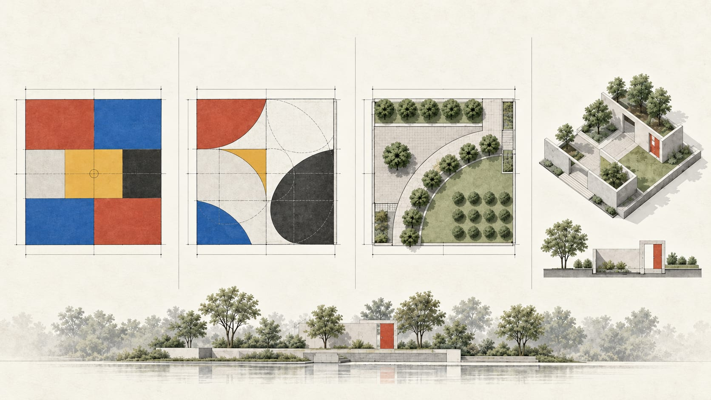

# The Definition of Space in the Landscape


> 景觀及都市設計・互動式參數設計工具  
> 以地面分割、弧線、植栽與牆體，逐步探索景觀空間的秩序、尺度與圍塑關係。

[立即開啟測試網頁](https://landscape-space-studio.jerry428tw.chatgpt.site/)

## 專案簡介

**The Definition of Space in the Landscape** 是為景觀及都市設計基礎課程開發的互動式設計工具。學生可以從平面構圖出發，逐步加入曲線、植栽、剖面與牆體，並以平面圖、剖立面圖及軸測圖反覆檢視空間關係，完成兼具構成秩序與空間感的景觀設計方案。

## 核心功能



### STEP 01｜水平・垂直分割

- 依 (1:\sqrt{1}) 至 (1:\sqrt{6}) 比例建立基地。
- 以水平、垂直主分割形成構圖，搭配最多三種色彩完成地面圖樣。
- 顯示尺寸標註，並可匯出平面圖 PNG。

### STEP 02｜弧線分割

- 以圓心、半徑與角度建立弧線；可沿分割點、邊界與外延長線定位。
- 以角度直覺判定弧線繪製方向，避免複雜的「起始分割邊」設定。
- 支援弧線清除、尺寸標註、縮放比例尺與 PNG 匯出。

### STEP 03｜基地平面設計

- 將構圖轉換為 A3、1:100 的景觀基地平面。
- 加入樹陣、樹列與孤植；可調整株數、行列、間距與位置。
- 建立多條剖面線，產生附尺寸標註的剖立面與軸測圖。

### STEP 04｜牆體・空間架構

- 沿直線分割、基地邊界或曲線直覺配置牆體。
- 編輯牆長、牆高與開口，檢視牆、樹與地面圖樣共同形塑的空間。
- 支援圖層顯示、鎖定、排序、複製與刪除。

## 使用方式

1. 開啟[測試網頁](https://landscape-space-studio.jerry428tw.chatgpt.site/)。
2. 依序完成 STEP 01 至 STEP 04。
3. 在各視圖使用縮放、比例尺與圖層控制，確認設計尺度。
4. 匯出平面、剖立面或軸測圖 PNG，作為作業成果圖。

## 技術架構

- Next.js / Vinext / TypeScript
- React 互動式繪圖介面
- CSS 與 SVG 圖面輸出
- 自動化測試：牆體配置與渲染內容檢查

## 本機執行

```bash
npm install
npm run dev
```

瀏覽器開啟終端機顯示的本機網址即可操作。

## 授權與使用

本專案供教學、研究與課程示範使用。使用或延伸本程式時，請保留專案名稱與來源說明。
