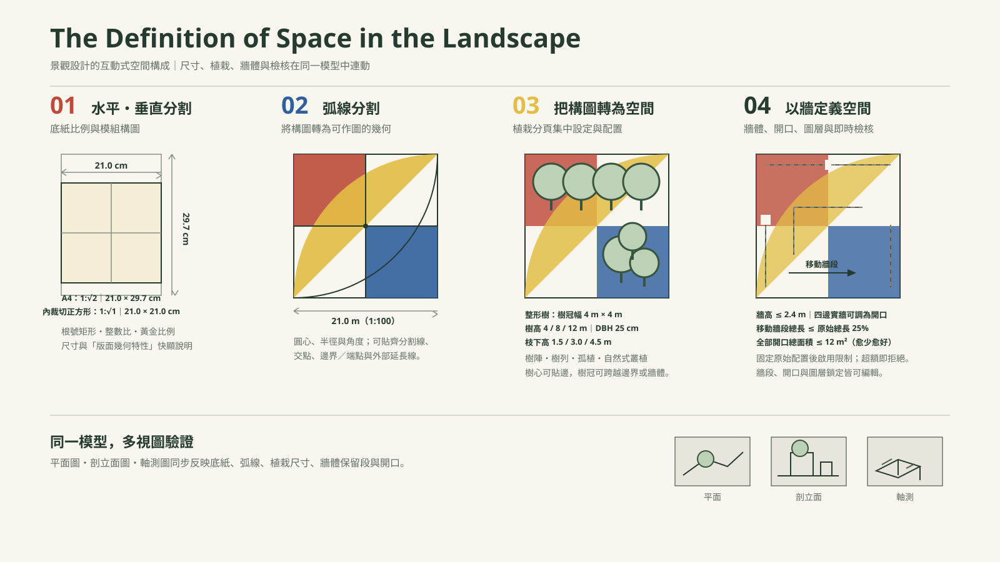

# The Definition of Space in the Landscape


> 景觀及都市設計・互動式參數設計工具  
> 以底紙比例、幾何分割、植栽與牆體，逐步驗證景觀空間的尺度、動勢與圍塑關係。

[立即開啟測試網頁](https://landscape-space-studio.jerry428tw.chatgpt.site/)

## 專案簡介

**The Definition of Space in the Landscape** 是為景觀及都市設計基礎課程開發的互動式設計工具。設計者從平面構圖出發，逐步加入弧線、植栽與牆體；平面圖、剖立面圖與軸測圖會同步反映設定，讓構成秩序與空間感能被反覆檢視、調整與輸出。

## 核心功能



### 尺寸與比例基準

- A4 紙張的比例為 **1:√2**，尺寸為 **21.0 × 29.7 cm**。
- 底紙在 A4 範圍內向內裁切；預設正方形為 **1:√1、21.0 × 21.0 cm**。
- STEP 03／04 採 1:100 對應：底紙的 21.0 × 21.0 cm 對應基地 **21.0 × 21.0 m（441.0 m²）**。更換底紙比例時，基地長寬會等比例連動。

### STEP 01｜水平・垂直分割

- 以底紙比例建立構圖，並提供根號矩形、**有理數比例（1:2、2:3、3:4）**與**黃金比例（1:φ ≈ 1:1.618）**作為次分割模組。
- 每個比例都有「版面幾何特性與視覺感受」快顯說明；尺寸、比率與色彩分割同步呈現。
- 支援尺寸標註與平面圖 PNG 匯出。

### STEP 02｜弧線分割

- 以圓心、半徑、角度與方向建立弧線，並承接 STEP 01 的水平、垂直分割與底紙尺寸。
- 圓心可吸附於分割線、交點、底紙邊界／端點及外部延長線；可清除、鎖定與編輯弧線。
- 支援尺寸標註、比例尺、縮放／平移與 PNG 匯出。

### STEP 03｜把構圖轉為空間

- 將 STEP 01／02 的圖樣轉為 1:100 基地平面；植栽規格統一在「植栽」分頁設定，不再重複出現在「基地」分頁。
- 整形樹規格：樹冠幅 **4 × 4 m**；樹高 **4、8、12 m**；胸徑 **DBH 25 cm**；枝下高 **1.5、3.0、4.5 m**，並提供空間知覺與行為體驗快顯。
- 可配置樹陣、樹列、孤植與自然式叢植；只限制樹幹中心位於基地內，樹冠可以跨越基地邊界或牆體。
- 剖面線、剖立面與軸測圖會隨樹高、枝下高與配置位置同步更新。

### STEP 04｜以牆定義空間

- 從四面實體邊界或開放邊界開始；可沿分割線、弧線與兩點自由畫牆配置，並能保留局部直線或曲線段。
- 初始配置固定後，才啟用空間調整限制：牆高 **≤ 2.4 m**、移動牆段總長 **≤ 原始配置總長的 25%**、全部開口總面積 **≤ 12 m²**。超額操作會立即拒絕並顯示剩餘額度。
- 支援門洞、全高缺口、景窗與透空邊界；非完整牆面會顯示其空間知覺與行為體驗。
- 牆段、開口與圖層皆可選取、鎖定、隱藏、編輯與還原；平面、剖立面與軸測圖皆依實際保留牆段與開口呈現。

## 使用方式

1. 開啟[測試網頁](https://landscape-space-studio.jerry428tw.chatgpt.site/)。
2. 依序完成 STEP 01 至 STEP 04，並在每一步檢查尺寸與圖層。
3. STEP 04 請先完成初始牆體方案，按下「固定原始配置，開始空間調整」後再移動或穿鑿牆面。
4. 以平面、剖立面、軸測圖與 PNG 匯出確認最終設計。

## 技術架構

- React / TypeScript / Vite（Vinext）
- SVG 互動繪圖與 PNG 匯出
- 牆體幾何、開口面積與移動額度即時驗證
- 自動化測試：牆體配置與渲染內容檢查

## 本機執行

```bash
npm install
npm run dev
```

瀏覽器開啟終端機顯示的本機網址即可操作。

## 授權與使用

本專案供教學、研究與課程示範使用。使用或延伸本程式時，請保留專案名稱與來源說明。
