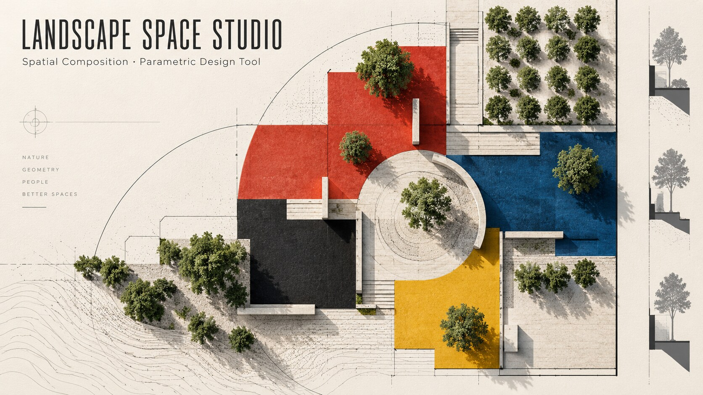

# The Definition of Space in the Landscape

> 以互動參數設計探索「景觀中的空間如何被定義」：從地面分割、弧線、植栽配置到牆體與剖立面，將抽象構成轉化為可操作、可閱讀的空間設計過程。

[](https://landscape-space-studio.jerry428tw.chatgpt.site/)

**測試網頁：** [landscape-space-studio.jerry428tw.chatgpt.site](https://landscape-space-studio.jerry428tw.chatgpt.site/)




## 專案簡介

**The Definition of Space in the Landscape** 是為景觀及都市設計基礎課程開發的互動式參數設計工具。學生可從平面構圖出發，逐步加入弧線、樹木、牆體與開口，再以平面、剖立面與軸測圖檢視設計方案的秩序、尺度、動線與圍塑關係。

本工具支援課程主題「景觀空間的定義」，以明確但具彈性的設計規則，協助學生反覆測試空間構成與設計判斷。

## 設計流程

| 階段 | 操作重點 | 學習目標 |
| --- | --- | --- |
| 01 | **水平／垂直分割** | 以可調整比例建立幾何秩序，發展不超過三色的平面構圖。 |
| 02 | **弧線分割** | 從可理解的幾何錨點繪製圓弧，與直線分割共同形塑空間節奏。 |
| 03 | **基地平面設計** | 以樹陣、樹列與孤植配置，測試株數、間距、偏移與對位關係。 |
| 04 | **牆體・空間架構** | 加入低牆與開口，並以剖立面與軸測圖評估圍塑、穿透與空間序列。 |

## 核心功能

- 可參數化調整的水平、垂直與曲線地面分割。
- 可編輯的樹陣、樹列與孤植，支援間距與尺寸標註。
- 牆體可沿分割線、基地邊界與曲線直覺放置，並可調整開口。
- 多條可編輯剖面線，連動平面、剖立面與軸測圖檢視。
- 平面、剖立面與軸測圖的縮放、比例尺與 PNG 匯出。
- 圖層顯示、鎖定、排序、複製與刪除管理。

## 空間構成規則

工具透過基本限制，使設計判斷與空間語彙更清晰：

- 地面構圖最多使用三種色彩。
- 牆體高度不超過 **2.4 m**。
- 可移動牆體總長度不超過基地限制長度的 **1/4**。
- 牆體開口總面積不超過 **12 m²**，並鼓勵以更少開口創造更清楚的空間結構。

## 教學應用

適合景觀及都市設計的基礎構成與空間設計課程，協助學生練習：

- 空間定義與視覺秩序；
- 植栽作為空間結構元素；
- 動線、滲透性與圍塑關係；
- 在平面、剖立面與軸測圖之間一致地閱讀設計。

## 專案結構

```text
The-Definition-of-Space-in-the-Landscape/
├── app/                 # 互動設計工具主要元件與幾何邏輯
├── public/              # 圖示、社群預覽圖與靜態資源
├── worker/              # 部署用 Worker
├── tests/               # 牆體與渲染測試
├── assets/images/       # README 封面與功能說明圖
└── README.md
```

## 授權

Copyright © 2026 Jerry Hsu. All rights reserved.
